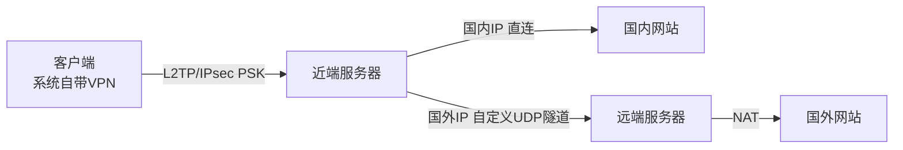
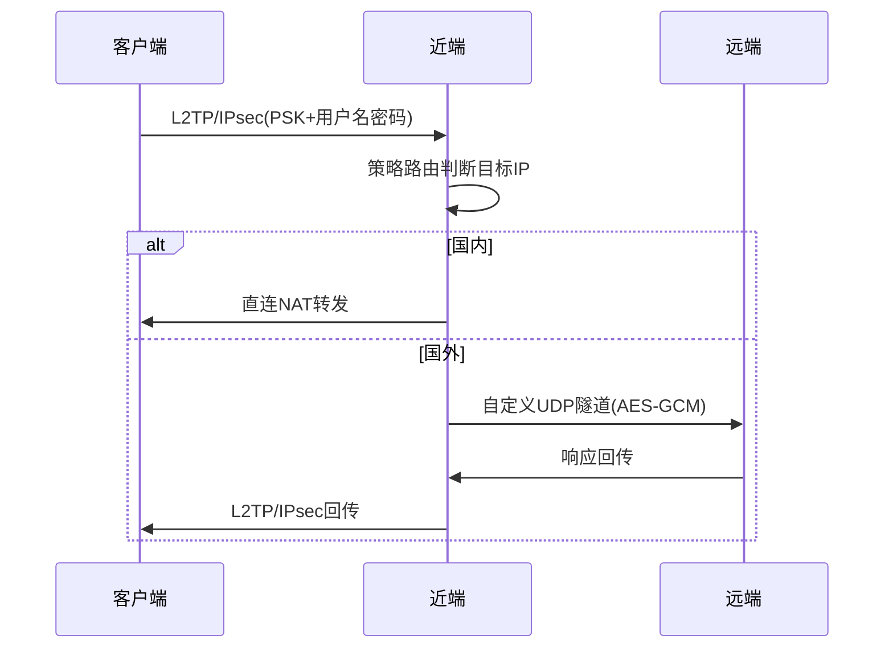

# MiniVPN 架构设计

## 1. 需求

| # | 需求 | 方案 |
|---|------|------|
| 1 | 对抗封锁 | 两跳架构：L2TP仅国内段；跨境用自定义UDP+AES-GCM+随机填充 |
| 2 | 系统自带VPN | L2TP/IPsec PSK，6平台原生支持 |
| 3 | 不装证书 | PSK模式，客户端只需：地址+密钥+用户名+密码 |
| 4 | 高效率 | C语言+UDP+AES-NI硬件加速+多隧道多线程 |

## 2. 架构

```
Client ─L2TP/IPsec PSK─> 近端(国内) ─自定义UDP隧道─> 远端(海外) ─> 目标
 系统自带VPN,零证书      strongSwan+minivpn       minivpn+NAT
```



### 数据流



## 3. 自定义隧道协议

### 加密

```
预共享密钥 → HKDF-SHA256 → encrypt_key(32B) + auth_key(32B)
```

### 帧格式

```
[Nonce:12B][加密区: Type:1B | Len:2B | Payload:0~1400B | Padding:随机][Tag:16B]
     ↑                    AES-256-GCM 加密                              ↑
   明文随机数                                                    认证标签
```

| Type | 说明 |
|:---:|------|
| 0x01 | DATA - IP包 |
| 0x02 | PING |
| 0x03 | PONG |
| 0x04 | AUTH |
| 0x05 | OK |

### 多隧道

```
近端 Worker0 ──UDP──> 远端 Worker0
     Worker1 ──UDP──> 远端 Worker1
     WorkerN ──UDP──> 远端 WorkerN

N = CPU核数，SO_REUSEPORT 绑定同一端口
按源IP哈希分配Worker，每个Worker独立epoll
```

## 4. 近端服务器

### 组件

| 组件 | 用途 |
|------|------|
| strongSwan + xl2tpd | L2TP/IPsec VPN服务端 |
| minivpn (client模式) | 自定义隧道客户端 |
| iptables + ip rule | 策略路由(国内直连/国外走隧道) |
| cron + update-routes.sh | 定期更新中国IP路由表 |

### L2TP/IPsec 配置

```
ipsec.secrets:  : PSK "预共享密钥"
chap-secrets:   user1 * pass123 *
```

### 策略路由(热更新,无需重启)

```bash
iptables -t mangle -A PREROUTING -s 10.10.10.0/24 -j MARK --set-mark 100
ip rule add fwmark 100 lookup 200 prio 100   # 中国IP直连
ip rule add fwmark 100 lookup 201 prio 200   # 其余走隧道
```

路由更新: `ip -batch` 批量操作,即时生效,已有连接不断。

## 5. 远端服务器

| 组件 | 用途 |
|------|------|
| minivpn (server模式) | 自定义隧道服务端 |
| iptables NAT | 转发到目标网站 |

## 6. 客户端配置

各平台系统自带VPN，只需4个信息：

| 信息 | 示例 |
|------|------|
| 服务器地址 | 1.2.3.4 |
| 预共享密钥 | my-psk |
| 用户名 | user1 |
| 密码 | pass123 |

| 平台 | 路径 |
|------|------|
| iOS | 设置 > VPN > 添加 > L2TP |
| macOS | 系统设置 > 网络 > VPN > L2TP |
| Windows | 设置 > 网络 > VPN > L2TP/IPsec PSK |
| Android/HarmonyOS | 设置 > VPN > L2TP/IPsec PSK |
| Linux | NetworkManager L2TP 插件 |

## 7. 源码结构

```
minivpn/
├── src/
│   ├── main.c        # 入口,参数解析,配置读取
│   ├── server.c      # 远端: 多Worker UDP监听→认证→epoll转发
│   ├── client.c      # 近端: 多Worker UDP连接→认证→epoll转发→重连
│   ├── worker.c/h    # Worker线程结构(多隧道核心)
│   ├── tun.c/h       # Linux TUN设备
│   ├── protocol.c/h  # 帧编解码+AES-GCM+HKDF
│   └── log.h         # 日志宏
├── scripts/
│   ├── deploy-entry.sh   # 近端一键部署
│   ├── deploy-exit.sh    # 远端一键部署
│   ├── update-routes.sh  # APNIC路由更新
│   └── add-user.sh       # 用户管理
├── configs/
│   └── minivpn.conf.example
├── Makefile
└── README.md
```

### 依赖

仅 `libcrypto`(OpenSSL) + `libpthread` + Linux内核(TUN/epoll)。

### 配置文件

```ini
mode = server              # server 或 client
listen = 0.0.0.0:4567      # server模式
# remote = 1.2.3.4:4567    # client模式
secret = my-secret-key
tun_ip = 172.16.0.1
tun_peer = 172.16.0.2
threads = 4                # 隧道并行数,默认=CPU核数
log_level = 1              # 0=error 1=info 2=debug
```

### 命令行

```bash
minivpn -s -l 0.0.0.0:4567 -k mysecret           # 远端
minivpn -c -r 远端IP:4567 -k mysecret              # 近端
minivpn -f /etc/minivpn/minivpn.conf               # 配置文件
```

## 8. 部署

```bash
# 远端(海外)
curl -sL .../deploy-exit.sh | bash -s -- -k mysecret -p 4567

# 近端(国内)
curl -sL .../deploy-entry.sh | bash -s -- \
    -r 远端IP:4567 -k mysecret \
    --vpn-psk "vpn密钥" --add-user user1:pass123
```

## 9. 实施计划

### 阶段一: C语言隧道程序
1. `log.h` - 日志宏
2. `protocol.h/c` - 帧编解码 + AES-256-GCM + HKDF
3. `tun.h/c` - TUN设备
4. `worker.h/c` - Worker线程
5. `server.c` - 服务端
6. `client.c` - 客户端
7. `main.c` - 入口和配置
8. `Makefile`

### 阶段二: 部署脚本
9. `deploy-exit.sh` - 远端部署
10. `deploy-entry.sh` - 近端部署
11. `update-routes.sh` - 路由更新
12. `add-user.sh` - 用户管理

### 阶段三: 文档
13. `README.md`
14. `minivpn.conf.example`
15. `client-guide.md` - 6平台配置指南
